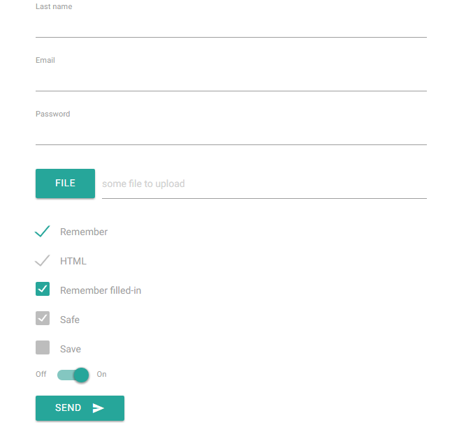

PortfolioForm
========

[](https://codeclimate.com/github/bcdbuddy/portfolio-form)
[](https://coveralls.io/r/bcdbuddy/portfolio-form?branch=master)

- [Installation](#installation)
- [Basic Usage](#basic-usage)
- [Using material icons](#using-material-icons)
- [Automatic Validation State](#automatic-validation-state)
- [Model Binding](#model-binding)
- [Different types](#different-types)
- [Advance usages](#advance-usages)
- [Todos](#todos)
- [Credits](#credits)
- [Licence](#licence)

## Installation

You can install this package via Composer by running this command in your terminal in the root of your project:

```bash
composer require bcdbuddy/portfolio-form
```

### Laravel

> This package works great as a replacement Form Builder that was removed in Laravel 5. The API is different but all of the features are there.

If you are using Laravel 4 or 5, you can register the FormServiceProvider to automatically gain access to the Old Input and Error Message functionality.

To do so, just update the `providers` array in your `config/app.php`:

```php
'providers' => [
    //...
    'bcdbuddy\PortfolioForm\ServiceProvider'
],
```

You can also choose to use the Facade by adding an alias in `config/app.php`:

```php
'aliases' => [
    //...
    'PortfolioForm' => 'bcdbuddy\PortfolioForm\Facades\PortfolioForm',
],
```

You can now start using MaterialForms by calling methods directly on the `PortfolioForm` facade:

```php
PortfolioForm::email('Email', 'email');
PortfolioForm::text('First name', 'first_name');
PortfolioForm::password('Password', 'password');
```

### Outside of Laravel

Usage outside of Laravel is a little trickier since there's a bit of a dependency stack you need to build up, but it's not too tricky.

```php
$formBuilder = new bcdbuddy\PortfolioForm\FormBuilder;

$formBuilder->setOldInputProvider($myOldInputProvider);
$formBuilder->setErrorStore($myErrorStore);
$formBuilder->setToken($myCsrfToken);

$basicMaterialFormsBuilder = new bcdbuddy\MaterialForms\BasicFormBuilder($formBuilder);
$horizontalMaterialFormsBuilder = new bcdbuddy\MaterialForms\HorizontalFormBuilder($formBuilder);

$bootForm = new bcdbuddy\MaterialForms\PortfolioForm($basicMaterialFormsBuilder, $horizontalMaterialFormsBuilder);
```

> Note: You must provide your own implementations of `bcdbuddy\Form\OldInputInterface` and `bcdbuddy\Form\ErrorStoreInterface` when not using the implementations meant for Laravel.

## Basic Usage

MaterialForms lets you create a label and form control and wrap it all in a form group in one call.

```php
//  <form method="POST">
//    <div class="form-field">
//      <label for="field_name">Field Label</label>
//      <input type="text" id="field_name" name="field_name">
//    </div>
//  </form>
{!! PortfolioForm::open() !!}
    {!! PortfolioForm::text('Field Label', 'field_name') !!}
{!! PortfolioForm::close() !!}
```

> Note: Don't forget to `open()` forms before trying to create fields!

### Customizing Elements

If you need to customize your form elements in any way (such as adding a default value or placeholder to a text element), simply chain the calls you need to make and they will fall through to the underlying form element.

Attributes can be added either via the `attribute` method, or by simply using the attribute name as the method name.

```php
// <div class="form-field">
//    <input type="text" id="first_name" name="first_name" placeholder="John Doe">
//    <label for="first_name">First Name</label>
// </div>
PortfolioForm::text('First Name', 'first_name')->placeholder('John Doe');

// <div class="form-field">
//   <select  id="color" name="color">
//     <option value="red">Red</option>
//     <option value="green" selected>Green</option>
//   </select>
//   <label for="color">Color</label>
// </div>
PortfolioForm::select('Color', 'color')->options(['red' => 'Red', 'green' => 'Green'])->select('green');

// <form method="GET" action="/users">
PortfolioForm::open()->get()->action('/users');

// <div class="form-field">
//    <label for="first_name">First Name</label>
//    <input type="text" id="first_name" name="first_name" value="John Doe">
// </div>
PortfolioForm::text('First Name', 'first_name')->defaultValue('John Doe');
```

## Using material icons
```php
PortfolioForm::open()->post()->action('/posts/'. $post->id);
    PortfolioForm::bind($post)
    PortfolioForm::text("Title", "title")
    PortfolioForm::textarea("Content", "content")
    PortfolioForm::submit("Save")->icon('save')
PortfolioForm::close()
```

or

```php
PortfolioForm::open()->post()->action('/user/login');
    PortfolioForm::text("Login", "login")->icon("account_circle")
    PortfolioForm::password("Password", "password")->icon("security")
    PortfolioForm::submit("Login")->icon('')
PortfolioForm::close()
```


### Reduced Boilerplate

Typical Materialize form boilerplate might look something like this:

```html
<form>
  <div class="form-field">
    <input type="text" name="first_name" id="first_name">
    <label for="first_name">First Name</label>
  </div>
  <div class="form-field">
    <input type="text" name="last_name" id="last_name">
    <label for="last_name">Last Name</label>
  </div>
  <div class="form-field">
    <input type="date" name="date_of_birth" id="date_of_birth">
    <label for="date_of_birth">Date of Birth</label>
  </div>
  <div class="form-field">
    <input type="email" name="email" id="email">
    <label for="email">Email address</label>
  </div>
  <div class="form-field">
    <input type="password" name="password" id="password">
    <label for="password">Password</label>
  </div>
  <button type="submit" class="btn waves-effect waves-light">Submit</button>
</form>
```

MaterialForms makes a few decisions for you and allows you to pare it down a bit more:

```php
{!! PortfolioForm::open() !!}
  {!! PortfolioForm::text('First Name', 'first_name') !!}
  {!! PortfolioForm::text('Last Name', 'last_name') !!}
  {!! PortfolioForm::date('Date of Birth', 'date_of_birth') !!}
  {!! PortfolioForm::email('Email', 'email') !!}
  {!! PortfolioForm::password('Password', 'password') !!}
  {!! PortfolioForm::submit('Submit') !!}
{!! PortfolioForm::close() !!}
```

### Automatic Validation State

Another nice thing about MaterialForms is that it will automatically add error states and error messages to your controls if it sees an error for that control in the error store.

Essentially, this takes code that would normally look like this:

```php
<div class="form-field">
  <input type="text" id="first_name" data-error="{!! $errors->first('first_name')"/>
  <label for="first_name">First Name</label>
</div>
```

And reduces it to this:

```php
{!! PortfolioForm::text('First Name', 'first_name') !!}
```

...with the `data-error` class being added automatically if there is an error in the session.


### Model Binding

MaterialForms makes it easy to bind an object to a form to provide default values. Read more about it [here](https://github.com/bcdbuddy/form#model-binding).

```php
PortfolioForm::open()->action( route('users.update', $user) )->put()
PortfolioForm::bind($user)
PortfolioForm::close()
```
## Different types
```php
    {!! PortfolioForm::text("Field label", "field_name") !!}
    {!! PortfolioForm::textarea("Field label", "field_name") !!}
    {!! PortfolioForm::email("Field label", "field_name") !!}
    {!! PortfolioForm::password("Field label", "field_name") !!}
    {!! PortfolioForm::file("Field label", "field_name") !!}    
    {!! PortfolioForm::checkbox("Field label", "field_name") !!}
    {!! PortfolioForm::datetime("Field label", "field_name") !!}
    {!! PortfolioForm::date("Field label", "field_name") !!}
    {!! PortfolioForm::time("Field label", "field_name") !!}


```

## Advance usages
```php
{!! PortfolioForm::open() !!}
    {!! PortfolioForm::text("Last name", "last_name") !!}
    {!! PortfolioForm::email("Email", "email") !!}
    {!! PortfolioForm::password("Password", "password") !!}
    {!! PortfolioForm::file("File", "file")->placeholder("some file to upload") !!}
    {!! PortfolioForm::checkbox("Remember", "remember")->checked() !!}
    {!! PortfolioForm::checkbox("HTML", "html")->disabled()->checked() !!}
    {!! PortfolioForm::checkbox("Remember filled-in", "remember filled-in")->addClass("filled-in")->checked() !!}
    {!! PortfolioForm::checkbox("Safe", "safe")->addClass("filled-in")->disabled()->checked() !!}
    {!! PortfolioForm::checkbox("Save", "save")->addClass("filled-in")->disabled()!!}
    {!! PortfolioForm::switchCheck("On", "Off", "state") !!}
    {!! PortfolioForm::select("One Select", "one_select", ["1", "2", "5", "10"]) !!}
    {!! PortfolioForm::select("One icon Select", "one_icon_select", ["1", "2", "5", "10"], ["http://lorempicsum.com/futurama/350/200/1", "http://lorempicsum.com/futurama/350/200/2", "http://lorempicsum.com/futurama/350/200/5", "http://lorempicsum.com/futurama/350/200/6"])->left() !!} // or right()
    {!! PortfolioForm::submit("Send")->icon("send") !!}
{!! PortfolioForm::close() !!}
```

## Output



## Todos
- radio input
- switch input
- file input

## Credits

- [Adam Wathan BootForms](https://github.com/adamwathan/bootforms)

## Licence 
[MIT](LICENSE)